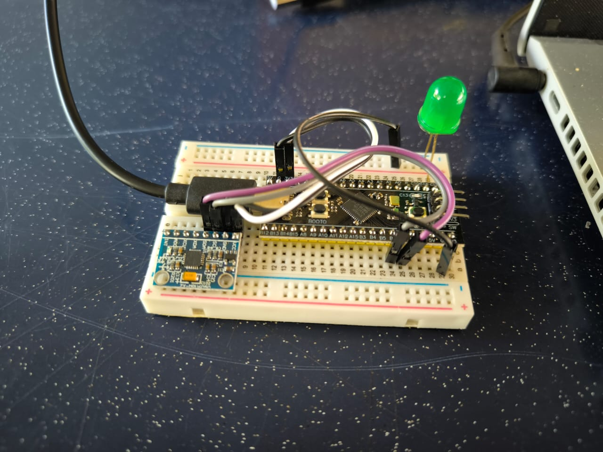

# Real-Time-Vibration-Analysis
Using STM32 Black Pill with MPU 6050 accelerator sensor

## Introduction ⌗
This project focuses on developing a real-time vibration analysis system using the STM32F411CEU6 microcontroller (Black Pill) and the MPU6050 sensor, integrated through I2C communication. The MPU6050 combines a 3-axis accelerometer and a 3-axis gyroscope, providing motion and vibration data for analysis. Data reading and processing were implemented using STM32CubeIDE, with results displayed in Serial Studio for visualization. The system serves practical applications such as detecting vibrations in machinery, monitoring structural integrity, or analyzing dynamic motions in robotics and vehicles.

---
## Documentation 📕
[Documentation.pdf](https://github.com/bropenguin847/Real-Time-Vibration-Analysis/blob/c50ab8061a654b9d546cf485ab14957f5d6b52c3/Documentation.pdf)

---
## 💾 Source Code Download ⬇️
[Download from the Latest Release](https://github.com/bropenguin847/Real-Time-Vibration-Analysis/releases/tag/v1.1)
<kbd>

</kbd>

---
## Video ▶️
[Demo Video on Youtube](https://youtu.be/wHUjtfv4aeY)

---
## Wiring Diagram 🔧
<kbd>

</kbd>

<kbd>

</kbd>

---
## Components ✅
<kbd>

</kbd>

---
## Flow Chart 🔀
<kbd>

</kbd>

## Results 📊
#### Not in Motion
<kbd>

</kbd>

#### In Motion, Vibration: Low
<kbd>

</kbd>

#### In Motion, Vibration: High
<kbd>

</kbd>

#### In Motion, Sudden Vibration
<kbd>

</kbd>

---
## Reference 📑

[Getting started with I2C](https://wiki.st.com/stm32mcu/wiki/Getting_started_with_I2C)

[Blackpill pinout](https://stm32world.com/wiki/Black_Pill#Pinout)

[Stm32 Hal I2c and Mpu6050 Imu](https://www.youtube.com/watch?v=P7a6qxacnO4)

[How to Interface MPU6050](https://controllerstech.com/how-to-interface-mpu6050-gy-521-with-stm32/)

[Stm32 Blackpill with USB serial](https://www.bennettnotes.com/notes/stm32-blackpill-with-stmcubeide-usb-serial/)

[Mpu 6050 Arduino Tutorial for Beginners](https://www.youtube.com/watch?v=SVI_NldMjlE)

[Datasheet with I2C Address](https://download.mikroe.com/documents/datasheets/MPU-6000_datasheet.pdf)
